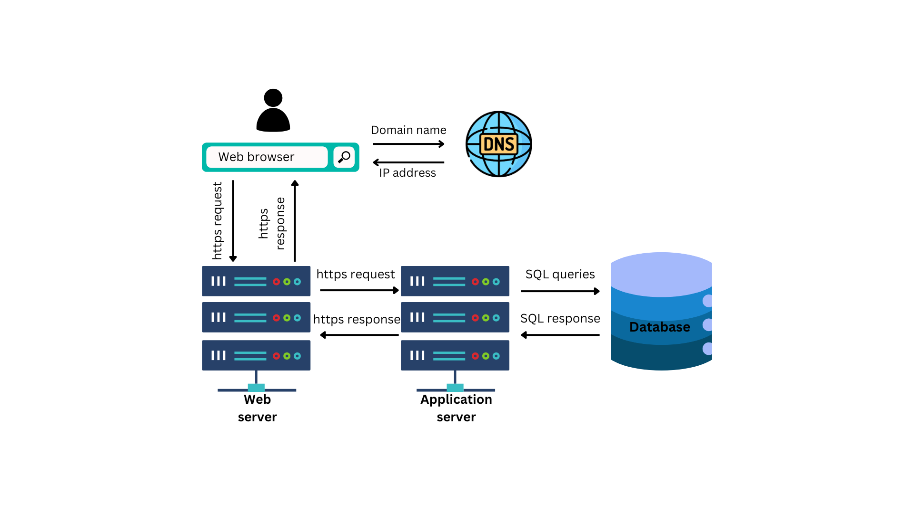

# E-Mechanic
Welcome to E-mechanic, your go-to web application for troubleshooting issues with your car. Whether you're facing engine troubles, electrical issues, or just need some general maintenance advice, E-mechanic is here to help guide you through the process.
It is designed to provide users with a simple yet effective way to diagnose and troubleshoot common car problems. With an intuitive interface and comprehensive database, users can easily find solutions to their automotive issues without the need for extensive knowledge or experience.

#### Try the project with this: 
https://girumz.github.io/alx_portfolio_project_1/

## Authers
#### Girum Zebene Tesfaye ([Github](https://github.com/GirumZ/alx_portfolio_project_1), [LinkedIn](https://www.linkedin.com/in/girum-tesfaye-666a6a270/), [X](https://twitter.com/GirumZebene), [Medium blog post](https://medium.com/@girum.zebe/how-my-first-web-app-project-come-to-life-the-genesis-of-e-mechanics-aa04b8e21562))

## Tools Used

E-mechanic is built using a combination of frontend and backend technologies to ensure a seamless user experience. The following tools were utilized in the development of this project:

- **HTML5**: Used for structuring the layout and content of the web pages.
- **CSS3**: Employed for styling and enhancing the visual presentation of the application.
- **JavaScript**: Utilized for adding interactivity and dynamic functionality to the frontend.
- **Flask**: Chosen as the backend framework for building the API endpoints and handling server-side logic.
- **MySQL**: Selected as the database management system for storing and managing car troubleshooting data efficiently.

These technologies work together harmoniously to deliver a robust and user-friendly experience for both novice and experienced car owners alike.

## Architecture 



## Installation

To get E-mechanic up and running on your local machine, follow these steps:

#### Prerequisites

Before proceeding with the installation, ensure you have the following software installed:

- Python
- MySQL Server
- Git

#### Clone the Repository

`git clone https://github.com/GirumZ/alx_portfolio_project_1.git`

#### Setup MySQL Database

- Navigate to the backend/data_processing directory 

cd backend/data_processing

- Run MySQL as root user

`Mysql -u root -p`

- Run the following commands from the mysql command line for setup and table creation

```
Source sql_setup.sql;
Source create_tables.sql;
```

- Exit mysql and run the following command to transfer the cvs data to the database

`python csv_to_databas.py` 

#### Run the API on the localhost

- Navigate to the api directory

`cd api/`

- Run the API

`flask run`
or
`python app.py`

Now the backend the database and the API are ready to be used locally

#### Open the index.html file

By navigating to the frontend directory, you can start using the web app through index.html

